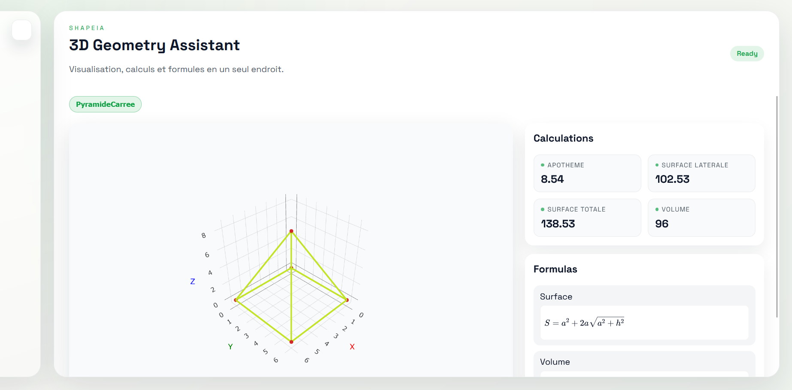
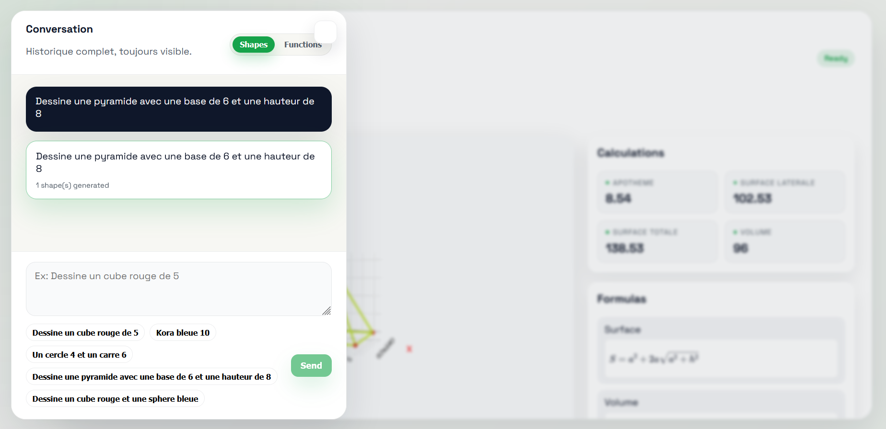
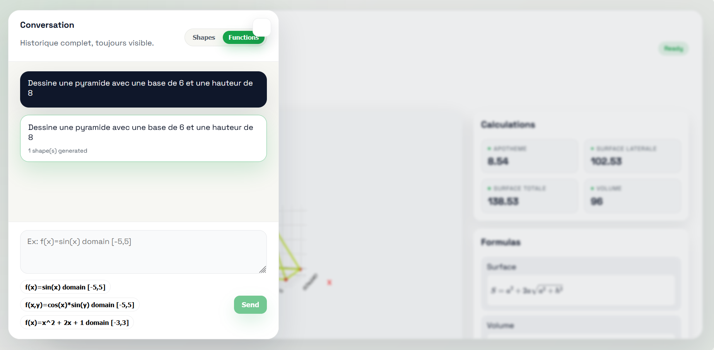

# ShapeIA

**ShapeIA** is an interactive geometry assistant capable of generating and visualizing **2D and 3D geometric objects from natural language commands**.

The system interprets user input, generates the corresponding geometry, computes its mathematical properties, and displays the result in an interactive visualization.

The goal of the project is to explore the combination of **natural language processing, geometry computation, and interactive visualization** within a simple web interface.

---

## Screenshots

### Main Interface


### Natural Language Shape Generation


### Function Visualization Mode


---

# Features

* Natural language commands for generating geometric shapes
* Interactive **2D and 3D visualization**
* Automatic computation of geometric properties
* Support for **multiple shapes in the same scene**
* Function plotting (2D and 3D)
* Chat-style interaction
* Tolerance to spelling variations using fuzzy matching

Commands can be written in **French, English, or Darija**.

---

# Example Commands

Examples of commands that can be interpreted by the assistant:

```
Dessine un cube rouge de 5
Kora bleue 10
Un cercle 4 et un carré 6
Dessine une pyramide avec une base de 6 et une hauteur de 8
f(x)=x^2 + 2x + 1 domain [-3,3]
f(x,y)=cos(x)*sin(y) domain [-5,5]
```

The system will interpret the command and generate the corresponding visualization and geometric calculations.

---

# Project Structure

```
ShapeIA
│
├── backend
│   ├── api
│   │   ├── __init__.py
│   │   └── main.py
│   │
│   └── src
│       ├── __init__.py
│       ├── bot_logic.py
│       ├── function_plotter.py
│       ├── geometry.py
│       └── nlp_parser.py
│
├── web
│   ├── src
│   │   ├── App.jsx
│   │   ├── main.jsx
│   │   └── styles.css
│   │
│   ├── index.html
│   ├── package.json
│   ├── package-lock.json
│   └── vite.config.js
│
│── assets
│   ├── home-interface.png
│   ├── chat-command.png
│   └── functions-mode.png
│
├── requirements.txt
├── .gitignore
└── README.md
```

The project is composed of two main parts:

**Backend**

* FastAPI server
* geometry generation
* command parsing
* function plotting

**Frontend**

* React interface
* interactive visualization
* chat interaction

---

# Technologies

Backend

* Python
* FastAPI
* NumPy
* Plotly
* FuzzyWuzzy
* python-Levenshtein

Frontend

* React
* Vite
* JavaScript
* CSS

Visualization

* Plotly interactive graphs

---

# Installation

Clone the repository

```
git clone https://github.com/zainazanouba/ShapeIA.git
cd ShapeIA
```

---

# Backend Setup

Create a virtual environment

```
python -m venv .venv
```

Activate it

Windows

```
.venv\Scripts\activate
```

Mac / Linux

```
source .venv/bin/activate
```

Install dependencies

```
pip install -r requirements.txt
```

Run the backend

```
uvicorn backend.api.main:app --reload --port 8000
```

The backend will run at

```
http://localhost:8000
```

---

# Frontend Setup

Open a second terminal

```
cd web
npm install
npm run dev
```

Then open

```
http://localhost:5173
```

---

# How It Works

1. The user enters a command describing a geometric object
2. The NLP module interprets the request
3. The geometry module generates the corresponding object
4. Mathematical properties are computed
5. The frontend displays the interactive visualization

---

# Contributors

This project was developed as part of a **collaborative group project**.

* Zainab Elkamit

---

# Running the Project

Backend

```
pip install -r requirements.txt
uvicorn backend.api.main:app --reload
```

Frontend

```
cd web
npm install
npm run dev
```

Open

```
http://localhost:5173
```

---
